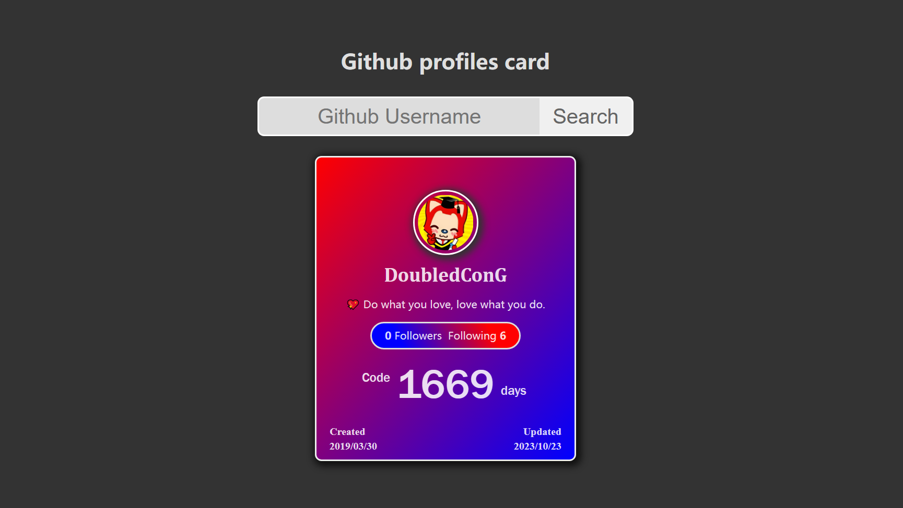

<h1 align="center">Github profiles card</h1>

Generate your github profiles card

## Usage

1. **Enter the github username then click `Search`.**

2. **You will get a card of the github profile that you enter.**

## Todo

1. ✅ **Adaptive mobile terminal.**
2. **Add a celebration animation.**
3. **Add particle dynamic background.**
